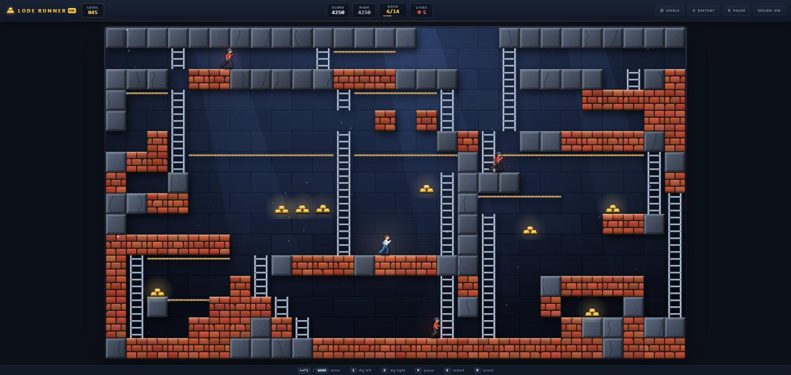
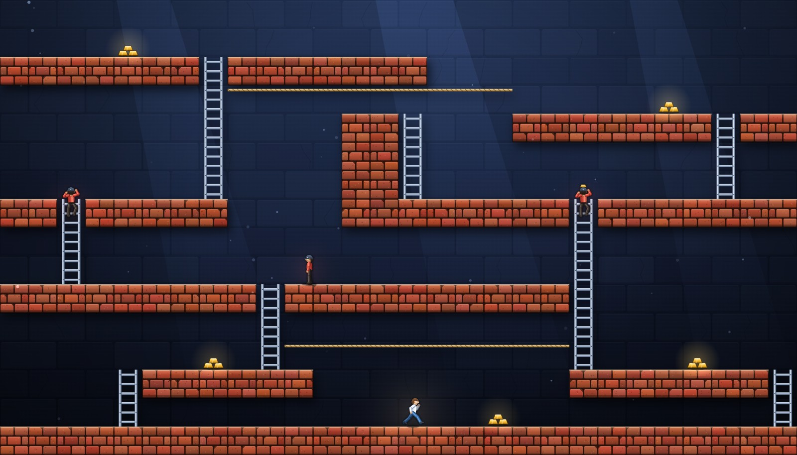
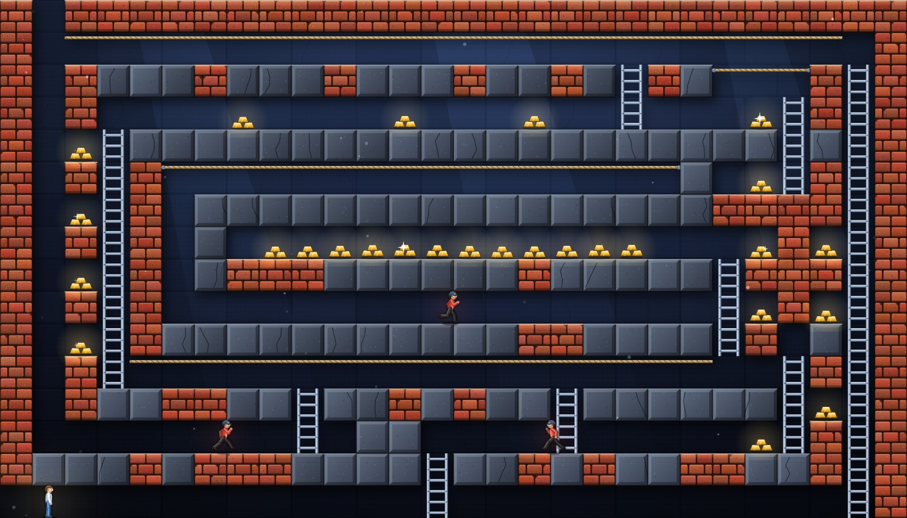
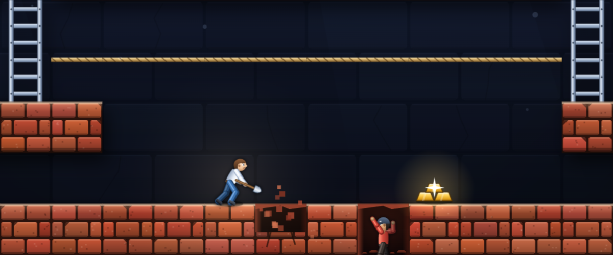
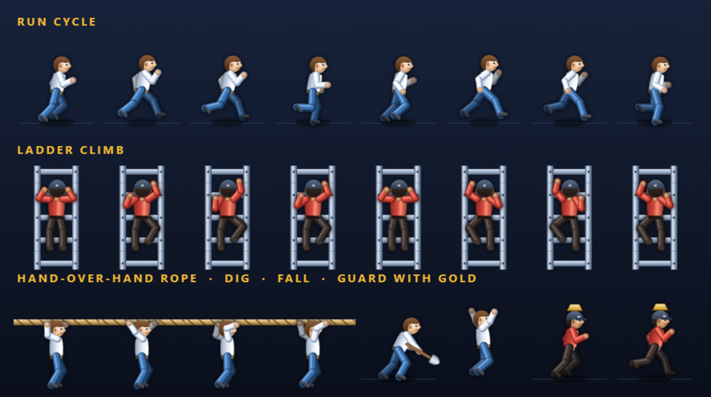
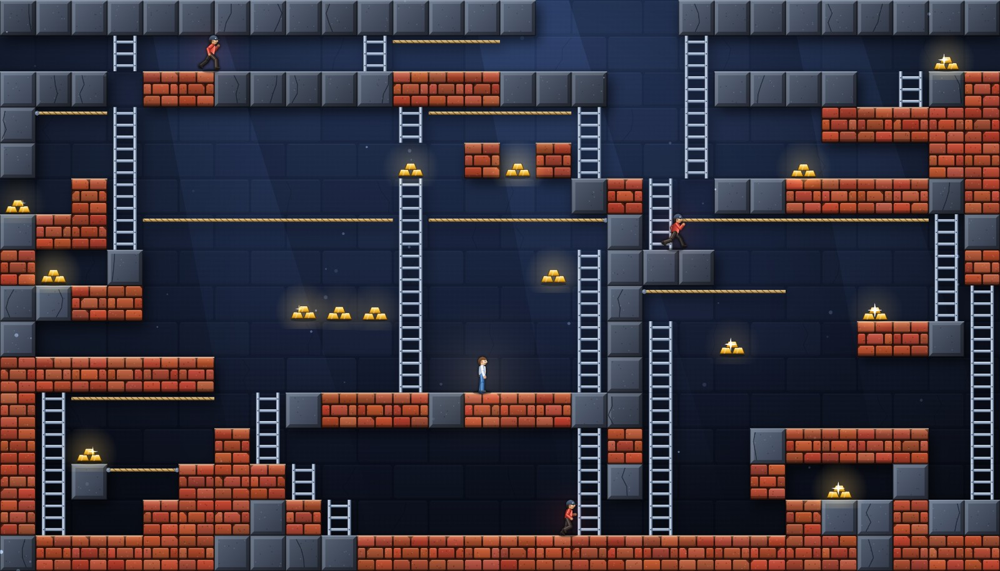

# Lode Runner — HD Remaster

A high-resolution browser remake of the 1983 Broderbund classic by Doug Smith, featuring **all 150 original Apple II levels** with authentic mechanics — rebuilt from scratch in vanilla JavaScript and HTML5 Canvas. No frameworks, no build step, no external assets.

   

### ▶ [Play it in your browser](https://robertorenz.github.io/loderunner/)

## Screenshots

<table>
  <tr>
    <td width="50%"></td>
    <td width="50%"></td>
  </tr>
  <tr>
    <td align="center"><b>Level 1</b> — guards take to the ladders as the runner sprints for the gold</td>
    <td align="center"><b>Level 57</b> — a gold vault walled in by undiggable bedrock</td>
  </tr>
</table>

### Dig, trap, escape

Digging takes real effort: the brick chips away under the shovel, debris flies, and the hole stays open for only a few seconds. Guards can't see holes — they charge straight over them and drop in.

### Characters that actually move

Every character is a jointed skeleton (thigh/shin, upper arm/forearm) with shaded, volumetric limbs. The run cycle — reach, plant, push-off, knee tuck, arm counter-swing — is driven by distance traveled, so feet never slide and slower guards take slower strides. Ladders are climbed rung by rung from behind, ropes are crossed hand over hand.

## Play

Play online at **[robertorenz.github.io/loderunner](https://robertorenz.github.io/loderunner/)**, or open `index.html` in any modern browser — that's it. (Or serve the folder, e.g. `python -m http.server`, and browse to it.)

Scripts and styles are loaded with a `?v=N` version query to defeat stale browser caches; if an update doesn't show, hard-refresh (Ctrl+F5).

## Controls

| Key | Action |
|---|---|
| `← → ↑ ↓` or `WASD` | Run, climb ladders, hang from ropes |
| `Z` / `X` | Dig left / dig right through brick floors |
| `P` | Pause |
| `R` | Restart level |
| `M` | Sound on/off |
| `L` | Level select |

## Gameplay

Collect every gold chest in the level, then climb to the top to escape. Guards chase you relentlessly — dig holes in brick floors to trap them (they climb back out, and holes regenerate, crushing anyone still inside). Watch out for **false bricks** you fall straight through, and **hidden ladders** that only appear once all gold is collected. Guards can pick up gold and carry it around; trap them to make them drop it.

- 250 pts per gold · 75 pts per trapped guard · 150 pts per crushed guard · 1,500 pts + 1 life per level
- Progress, high score, and completed levels are saved locally in your browser

## Features

**Faithful to the original**
- All 150 original levels, extracted from the Apple II disk image (level data via [SimonHung/LodeRunner](https://github.com/SimonHung/LodeRunner))
- Classic guard AI ported from the Apple II algorithm: same-row pursuit, then a floor scan that rates every drop-off and ladder by the row it reaches; guards are blind to dug holes
- Authentic rules: one-way holes, false bricks, hidden escape ladders, gold-carrying guards, count-based guard speeds, respawning

**Remastered presentation**
- Crisp high-DPI canvas rendering with a lit stone backdrop, cast shadows, light shafts and drifting dust
- Hand-textured terrain: every brick and bedrock block is procedurally varied, with lit top surfaces and chipped edges
- Volumetric, skeleton-animated characters with a real run cycle, rung-by-rung ladder climbing and hand-over-hand rope traversal
- Glowing gold with bloom and glints, additive sparkle particles, animated dig/close holes, iris wipe on death
- Polished HUD: stat cards, live gold-progress bar, icon buttons, framed stage and in-canvas level banners
- Everything is drawn in code and all sound is WebAudio-synthesized — zero image or audio files
- Level select for all 150 levels with completion tracking; auto-pause when the tab loses focus

## Files

| File | Purpose |
|---|---|
| `index.html` | Page shell, HUD, and modal system |
| `style.css` | Dark professional theme: HUD, stage frame, modals |
| `game.js` | Engine: physics, digging, guard AI, rendering, UI |
| `levels.js` | All 150 original level grids (28×16) |
| `audio.js` | WebAudio synthesized sound effects |
| `docs/screenshots/` | README images (captured from the live game) |

## Credits

- Original game: Doug Smith / Broderbund (1983)
- Level data: extracted from the Apple II disk image, via the [SimonHung/LodeRunner](https://github.com/SimonHung/LodeRunner) preservation project
- This is a non-commercial fan remake built for personal and educational use

🤖 Generated with [Claude Code](https://claude.com/claude-code)
